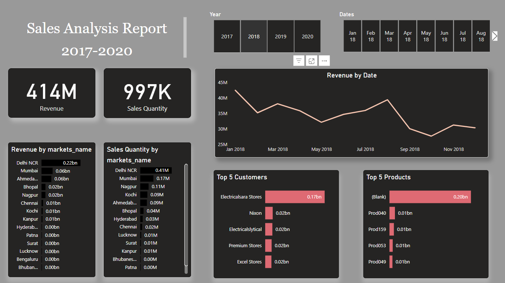

# Sales Data Analysis Dashboard

<div align="center">
  
  
  ### [View Interactive Dashboard ↗](https://app.powerbi.com/view?r=eyJrIjoiNDFmZTJlMTEtMWE5ZS00NmFlLWEwOTgtM2UxMmE4ZDQxYTY4IiwidCI6IjAzNWRkZWY2LTI0MzMtNDhiNi04NTI2LTcwY2E4MTgxZjc2ZCIsImMiOjN9&embedImagePlaceholder=true)
</div>

## 🎯 Problem Statement
[Rest of the README content remains the same...]
## 🎯 Problem Statement
Sales team needs to unlock hidden insights from sales data to support better decision-making and automate the manual data gathering process. The key objectives are:
- Create an automated dashboard for quick sales insights
- Enable data-driven decision making
- Reduce manual data gathering time by 20%
- Achieve 10% cost savings through better decisions

## 🛠️ Tools & Technologies Used

<div align="center">
  
  
  
</div>

## 📊 Dataset Overview
The analysis is based on the following tables:
- Customers
- Transactions
- Products
- Markets
- Date

## 🔄 SQL Analysis Process

### 1. Data Exploration
```sql
-- Initial data exploration to understand table structures
SELECT * FROM sales.customers LIMIT 5;
SELECT * FROM sales.transactions LIMIT 5;
SELECT * FROM sales.products LIMIT 5;
```

### 2. Data Volume Analysis
```sql
-- Understanding data volume
SELECT COUNT(*) FROM sales.transactions;
SELECT COUNT(*) FROM sales.customers;
SELECT COUNT(*) FROM sales.products;
SELECT COUNT(*) FROM sales.markets;
```

### 3. Market Analysis
```sql
-- Analysis of specific markets
SELECT * FROM sales.transactions WHERE market_code = "Mark001";
SELECT COUNT(*) FROM sales.transactions WHERE market_code = "Mark001";
```

### 4. Sales Analysis
```sql
-- Revenue analysis for 2020
SELECT SUM(sales.transactions.sales_amount) 
FROM sales.transactions 
INNER JOIN sales.date 
ON sales.transactions.order_date = sales.date.date 
WHERE year = "2020";
```

### 5. Currency Standardization
```sql
-- Identifying transactions in USD
SELECT * FROM sales.transactions WHERE currency = "USD";
```

## 📈 Key Sales Insights

### Revenue Analysis
- Total Revenue: 414M
- Total Sales Quantity: 997K

### Top Performing Markets (by Revenue)
1. Delhi NCR (0.22bn)
2. Mumbai (0.06bn)
3. Ahmedabad (0.06bn)
4. Bhopal (0.02bn)
5. Nagpur (0.02bn)

### Top Customers
1. Electricalsara Stores (0.17bn)
2. Nixon (0.02bn)
3. Electricalslytical (0.02bn)
4. Premium Stores (0.02bn)
5. Excel Stores (0.02bn)

### Top Products
1. (Blank) (0.20bn)
2. Prod040 (0.01bn)
3. Prod159 (0.01bn)
4. Prod053 (0.01bn)
5. Prod049 (0.01bn)

## 📊 Dashboard Features
- Interactive sales analysis by market
- Revenue trends over time (2017-2020)
- Customer performance analysis
- Product performance metrics
- Market-wise sales quantity distribution
- Year-over-year growth analysis

## 🎯 Project Impact
- Automated dashboard replacing manual data gathering
- Saved 20% of analysts' time
- Enabled data-driven decision making
- Provided clear market performance visibility
- Identified key revenue-generating customers and products

## 🚀 Future Enhancements
- Integration with real-time data
- Advanced predictive analytics
- Customer segmentation analysis
- Product recommendation engine
- Mobile-friendly dashboard version

## 📝 Notes
- Data ranges from 2017 to 2020
- Currency variations (USD/INR) have been standardized
- Regular updates planned for maintaining data accuracy

---
*Created by IBRAHIM MUSTAFA ZABI 
*Last Updated: 25 NOV 2024
