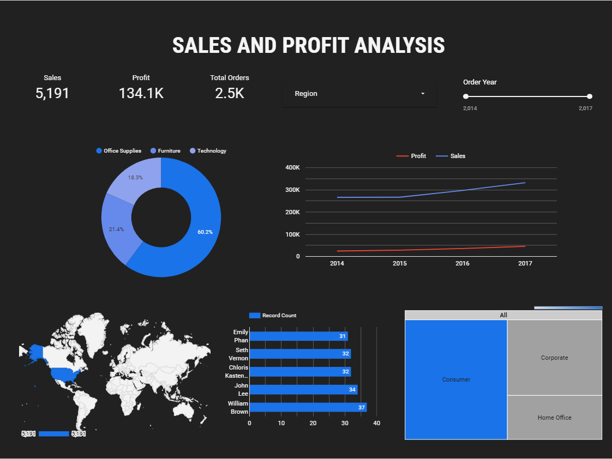

# 📊 Sales and Profit Analysis Dashboard

  
**[Click here to view the full dashboard](https://lookerstudio.google.com/s/hJpf2rTdnM0)**

This project is a **dynamic, interactive dashboard** built using **Looker Studio**. It provides actionable insights into sales and profitability trends, customer behaviors, and regional performance. Designed for data-driven decision-making, the dashboard incorporates intuitive visualizations and advanced filters.

---

## 🔍 **Project Overview**

- **Objective**: Analyze sales, profit, and customer data to derive business insights.
- **Data Source**: Historical sales data for multiple categories (Office Supplies, Furniture, Technology).
- **Tools Used**: 
  - 📊 ****
    for creating dashboards.
  - 📂 ****
    for initial data processing.

---

## 🌟 **Key Features**

### 📈 **Sales and Profit Insights**
- Year-over-year trends for sales and profit.
- Key performance indicators (KPIs) for total orders, total sales, and total profit.

### 🗺️ **Regional and Customer Analysis**
- Geo-mapped visualizations for sales by region and state.
- Top customers by profit contribution.

### 📦 **Product and Category Performance**
- Sales breakdown by product category (Office Supplies, Furniture, Technology).
- Profitability analysis by sub-categories.

### 🔧 **Interactivity**
- Date range filters for customized analyses.
- Dropdown filters for regions, product categories, and customer segments.

---

## 📂 **File Structure**
- `Data Source.xlsx` - Raw data used for visualization.
- `Untitled_Report.pdf` - Exported dashboard report.
- `README.md` - Documentation for the project.

---

## 🛠️ **Tools Used**

### 1. **Looker Studio**
  
Google Looker Studio was used to design the interactive dashboard, enabling advanced filtering and dynamic visualizations.

---

### 2. **Microsoft Excel**
  
Microsoft Excel was employed for data cleaning, processing, and preparing the dataset for analysis.

---

## 🖥️ **How to Access**
1. Clone this repository:
   ```bash
   git clone https://github.com/yourusername/sales-analysis-dashboard.git
